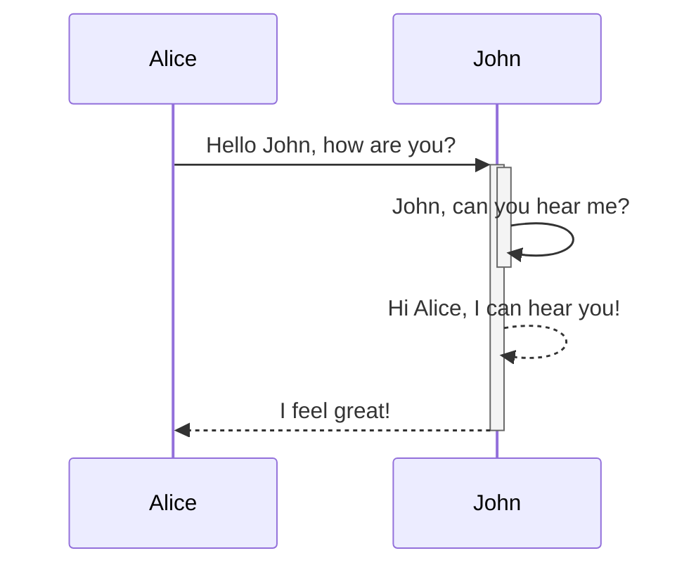

# Git使用指南
## 简介
在软件工程中，版本控制，又称源码管理，常用的版本控制软件有：
* Apache **S**ub**V**sio**N**
* **Git** (/ɡɪt/)

<details><summary>冷知识：VOK/VPK的全写是什么？</summary>
<p>

* **V**ision **O**riginal **K**it
* **V**ision **P**rofessional **K**it

</p>
</details>

## SVN vs Git
| Git           | SVN           |
| ------------- |:-------------:|
| Git是分布式的 | SVN是集中式的 |
| 它通过本地库管理代码，而不是集中式的服务器      | 通过集中式服务器来存储代码      | 
| 在Git提交代码无须网络 | 几乎SVN所有操作都需要网络 |   


```bash
git status
```


