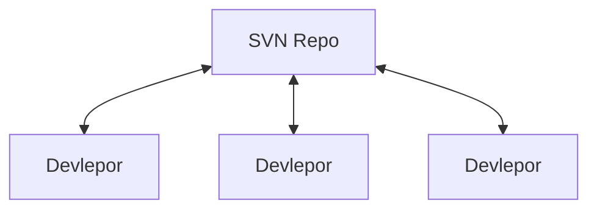
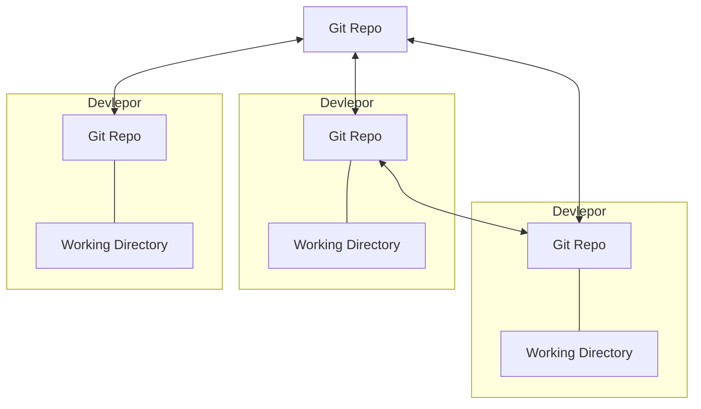
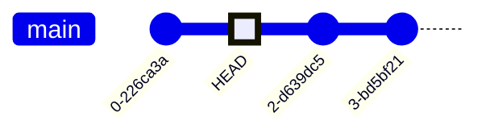
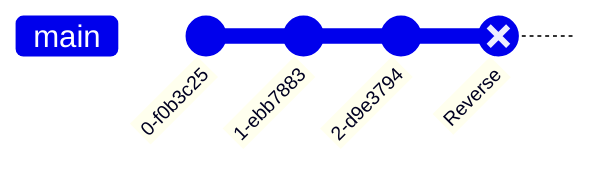
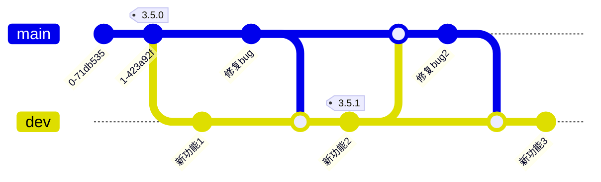

# Git使用指南
## 简介
在软件工程中，版本控制，又称源码管理，常用的版本控制软件有：
* Apache **S**ub**V**sio**N**
* **Git** (/ɡɪt/)

<details><summary>冷知识：VOK/VPK的全称是什么？</summary>
<p>

* **V**ision **O**riginal **K**it
* **V**ision **P**rofessional **K**it

</p>
</details>

## SVN vs Git
| Git           | SVN           |
| ------------- |:-------------:|
| Git是分布式的 | SVN是集中式的 |
| 它通过本地库管理代码，而不是集中式的服务器      | 通过集中式服务器来存储代码      | 
| 在Git提交代码无须网络 | 几乎SVN所有操作都需要网络 | 
| 灵活 | ？？？ |  

### SVN部署图


### Git部署图



## 常用的Git操作

### clone，克隆
```bash
git clone http://gitaudit.bmtek.com/ivi/vpk/edge_node/vpk_document.git
git clone /usr/projects/my_repo.git
```

### status，查看未提交的变更状态
```bash
git status
```

### add，暂存文件准备提交
```bash
git add *
git add README.md src/main.cpp
```

### commit，提交代码
```bash
git commit --message 'Add README.md and main.cpp'
```

### push，推送变更记录到指定的远程库，默认以orgin为远程库
```bash
git push [--set-upstream origin]
```

### fetch，更新远程库最新的代码到本地库中（的缓存）
```bash
git fetch orgin
git fetch upstream
git fetch upstream main
```

### merge，将远程分支（的缓存）与本地文件合并，并且提交到本地库
```bash
git merge upstream/main
```

### reset，重置到指定节点
```bash
# HEAD是游标，它所指向的节点，就是当前工作节点
git reset --hard [HEAD] # 默认重置到最新的节点，并清除未提交的变更
git reset --hard [HEAD~2] # 重置到前2个节点
git reset --soft
git reset --mixed
```


### revert，还原最近一次的提交
```bash
git revert
```



### checkout/branch，多分支实现多本版并行开发
```bash
git checkout main
git checkout dev
```


